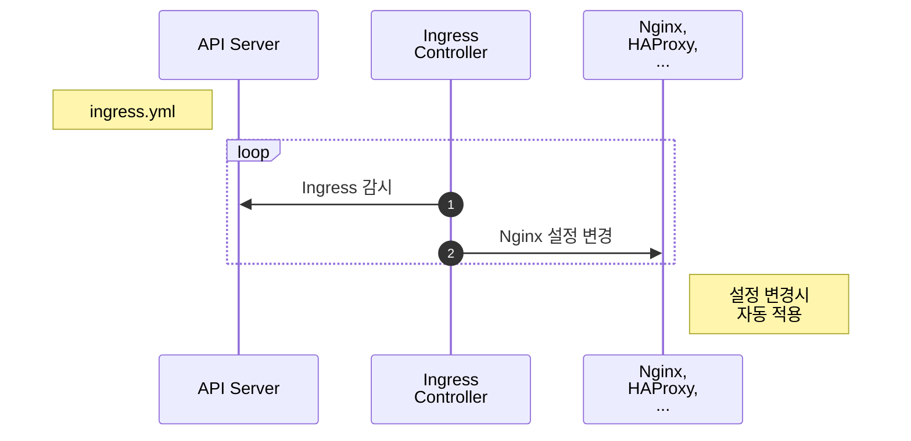

# Ingress

::: tip ⚡️ 목표
도메인을 이용하여 서로 다른 서비스에 접근하는 방법을 알아봅니다.
:::

하나의 클러스터에서 여러 가지 서비스를 운영한다면 외부 연결을 어떻게 할까요? NodePort를 이용하면 서비스 개수만큼 포트를 오픈하고 사용자에게 어떤 포트인지 알려줘야 합니다. 그럴순 없죠!


위 샘플은 `example.com`, `subicura.com/blog`, `subicura.com/help` 주소로 서로 다른 서비스에 접근하는 모습입니다. `80(http)` 또는 `443(https)` 포트로 여러 개의 서비스를 연결해야 하는데 이럴 때 `Ingress`를 사용합니다.

[[toc]]

## Ingress 만들기

echo 웹 애플리케이션을 버전별로 도메인을 다르게 만들어 보겠습니다.

`minikube ip`로 테스트 클러스터의 노드 IP를 구하고 도메인 주소로 사용합니다. 결과 IP가 `192.168.64.5`라면 사용할 도메인은 다음과 같습니다.

- [v1.echo.192.168.64.5.sslip.io](http://v1.echo.192.168.64.5.sslip.io)
- [v2.echo.192.168.64.5.sslip.io](http://v2.echo.192.168.64.5.sslip.io)

::: tip
도메인을 테스트하려면 여러가지 설정이 필요합니다. 여기서는 별도의 설정없이 IP주소를 도메인에 넣어 바로 사용할 수 있는 [sslip.io](https://sslip.io) 서비스를 이용합니다.
:::

### minikube에 Ingress 활성화하기

Ingress는 Pod, ReplicaSet, Deployment, Service와 달리 별도의 컨트롤러를 설치해야 합니다. 여러 가지 컨트롤러 중에 입맛에 맞게 고를 수 있는데 여기서는 nginx ingress controller를 사용합니다.

::: tip Ingress Controller
nginx를 제외한 대표적인 컨트롤러로 haproxy, traefik, alb등이 있습니다.
:::

```sh
minikube addons enable ingress

# ingress 컨트롤러 확인
kubectl -n kube-system get pod
```

**실행 결과**

```{4-6}
NAME                                        READY   STATUS      RESTARTS   AGE
coredns-f9fd979d6-26cqh                     1/1     Running     2          4d3h
etcd-minikube                               1/1     Running     2          4d3h
ingress-nginx-admission-create-wgfxt        0/1     Completed   0          17m
ingress-nginx-admission-patch-d57wz         0/1     Completed   0          17m
ingress-nginx-controller-558664778f-tpqdr   1/1     Running     0          17m
kube-apiserver-minikube                     1/1     Running     2          4d3h
kube-controller-manager-minikube            1/1     Running     2          4d3h
kube-proxy-ps7gw                            1/1     Running     2          4d3h
kube-scheduler-minikube                     1/1     Running     2          4d3h
storage-provisioner                         1/1     Running     5          4d3h
```

잘 설정 되었는지 확인합니다.

```sh
curl -I http://192.168.64.5/healthz # minikube ip를 입력
```

**실행 결과**

```
HTTP/1.1 200 OK
Date: Sat, 05 Dec 2020 13:53:37 GMT
Content-Type: text/html
Content-Length: 0
Connection: keep-alive
```

### echo 웹 애플리케이션 배포

Nginx Ingress Controller 설치가 완료되면 echo 웹 애플리케이션을 배포합니다. v1, v2 2가지를 배포합니다.

Ingress Spec중에 `rules.host`부분을 `minikube ip`로 변경해야 합니다.

<<< @/src/.vuepress/public/code/guide/ingress/echo-v1.yml{7}
<code-link link="guide/ingress/echo-v1.yml"/>

<<< @/src/.vuepress/public/code/guide/ingress/echo-v2.yml{7}
<code-link link="guide/ingress/echo-v2.yml"/>

::: warning v1.18 이하 버전
쿠버네티스 v1.19부터 Ingress Spec 중 `rules.http.paths.backend`가 변경되었습니다. v1.18 이하라면 `pathType`을 제거하고 `backend`를 다음과 같이 변경해주세요.

```
backend:
  serviceName: echo-v1
  servicePort: 3000
```

:::

Deployment, Service, Ingress를 생성합니다.

```sh
kubectl apply -f echo-v1.yml,echo-v2.yml

# Ingress 상태 확인
kubectl get ingress
kubectl get ing
```

**실행 결과**

```{2,3}
NAME      CLASS    HOSTS                           ADDRESS        PORTS   AGE
echo-v1   <none>   v1.echo.192.168.64.5.sslip.io   192.168.64.5   80      48s
echo-v2   <none>   v2.echo.192.168.64.5.sslip.io   192.168.64.5   80      48s
```

`v1.echo.192.168.64.5.sslip.io`과 `v2.echo.192.168.64.5.sslip.io`로 접속 테스트합니다.

## Ingress 생성 흐름

Ingress가 어떻게 동작하는지 알아봅니다.

::: mermaid



:::

1. `Ingress Controller`는 `Ingress` 변화를 체크
2. `Ingress Controller`는 변경된 내용을 `Nginx`에 설정하고 프로세스 재시작

동작방식을 보면 YAML로 만든 Ingress 설정을 단순히 nginx 설정으로 바꾸는 걸 알 수 있습니다. 이러한 과정을 수동으로 하지 않고 Ingress Controller가 하는 것 뿐입니다.

Ingress는 도메인, 경로만 연동하는 것이 아니라 요청 timeout, 요청 max size 등 다양한 프록시 서버 설정을 할 수 있습니다. 상세 설정은 추후 고급편에서 다시 다루겠습니다.

## 마무리

Ingress를 사용하면 YAML 설정만으로 도메인, 경로 설정을 손쉽게 할 수 있습니다. 기존에 도메인을 연결하려면 담당자에게 요청하고 설정 파일을 변경한 다음 프로세스 재시작까지 수동으로 작업했는데, 더 이상 그런 과정을 거치지 않아도 됩니다.

## 참고

[Ingress v1 networking.k8s.io](https://kubernetes.io/docs/reference/generated/kubernetes-api/v1.20/#ingress-v1-networking-k8s-io)

## 문제

**문제1. 다음 조건을 만족하는 Ingress를 만드세요.**

| 키                | 값                 |
| ----------------- | ------------------ |
| Deployment 이름   | nginx              |
| Deployment Label  | app: nginx         |
| Deployment 복제수 | 3                  |
| Container 이름    | nginx              |
| Container 이미지  | nginx:latest       |
| Ingress 도메인    | nginx.xxx.sslip.io |

::: details 정답
<<< @/src/.vuepress/public/code/guide/ingress/exam1.yml
<code-link link="guide/ingress/exam1.yml"/>
:::
