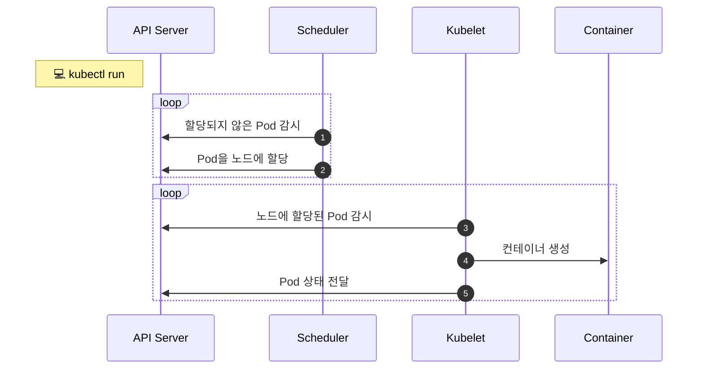

# Pod

::: tip ⚡️ 목표
Pod이 무엇인지 알아보고 기본적인 사용법을 익힙니다. YAML을 이용하여 설정파일을 작성합니다.
:::

Pod은 쿠버네티스에서 관리하는 가장 작은 배포 단위입니다.

쿠버네티스와 도커의 차이점은 도커는 컨테이너를 만들지만, 쿠버네티스는 컨테이너 대신 Pod을 만듭니다. Pod은 한 개 또는 여러 개의 컨테이너를 포함합니다.

컨테이너가 아니라 Pod을 사용하고 여러개의 컨테이너를 포함할 수 있다고...? 🤔 무슨말인지 확인해봅시다.

[[toc]]

## 빠르게 Pod 만들기

`docker run`에 익숙한 분들을 위해 `kubectl run` 명령어를 소개합니다.

```sh
kubectl run echo --image ghcr.io/subicura/echo:v1
```

::: warning 주의
kubernetes v1.18 이상은 `run`명령어가 Pod을 만들지만 v1.17 이하는 Deployment를 만듭니다.
:::

`echo`라는 이름의 Pod이 잘 생성되었는지 확인합니다.

```sh
# Pod 목록 조회
kubectl get pod
```

**실행 결과**

```{2}
NAME   READY   STATUS              RESTARTS   AGE
echo   0/1     ContainerCreating   0          10s
```

생성된 Pod의 상태를 간략하게 확인할 수 있습니다. 상태<sup>STATUS</sup>는 컨테이너가 정상적으로 생성되면 `Running`으로 바뀌고 오류가 있다면 에러 상태를 표시합니다.

그럼 더 상세하게 Pod의 상태를 확인해봅니다.

```sh
# 단일 Pod 상세 확인
kubectl describe pod/echo
```

**실행 결과**

```{8-15}
Name:         echo
Namespace:    default
Priority:     0
Node:         minikube/192.168.64.5

...(생략)...

Events:
  Type    Reason     Age   From               Message
  ----    ------     ----  ----               -------
  Normal  Scheduled  68s   default-scheduler  Successfully assigned default/echo to minikube
  Normal  Pulling    68s   kubelet            Pulling image "ghcr.io/subicura/echo:v1"
  Normal  Pulled     35s   kubelet            Successfully pulled image "ghcr.io/subicura/echo:v1" in 33.176019499s
  Normal  Created    35s   kubelet            Created container echo
  Normal  Started    35s   kubelet            Started container echo
```

`describe` 명령어는 해당 리소스의 상세한 정보를 알려줍니다. 쿠버네티스를 운영하면서 가장 많이 확인하는 부분은 `Events`입니다. 현재 Pod의 상태를 이벤트별로 확인할 수 있습니다.

### Pod 생성 분석

Pod은 다음과 같이 구성되어있습니다. minikube 클러스터 안에 Pod이 있고 Pod 안에 컨테이너가 있습니다.

<div style="text-align: center; width: 300px; max-width: 100%; margin: 0 auto">
  <custom-image src="/imgs/guide/pod/pod-single.png" alt="Pod(단일 컨테이너)" />
</div>

`kubectl run`을 실행하고 Pod이 생성되는 과정을 살펴봅니다.

::: mermaid



:::

1. `Scheduler`는 API서버를 감시하면서 할당되지 않은<sup>unassigned</sup> `Pod`이 있는지 체크
2. `Scheduler`는 할당되지 않은 `Pod`을 감지하고 적절한 `노드`<sup>node</sup>에 할당 (minikube는 단일 노드)
3. 노드에 설치된 `kubelet`은 자신의 노드에 할당된 `Pod`이 있는지 체크
4. `kubelet`은 `Scheduler`에 의해 자신에게 할당된 `Pod`의 정보를 확인하고 컨테이너 생성
5. `kubelet`은 자신에게 할당된 `Pod`의 상태를 `API 서버`에 전달

잘 디자인된 모듈이 각자 역할을 충실하게 수행하고 있는 모습입니다. 현재 테스트는 단일 노드지만 노드가 수십, 수백 개가 되어도 `Scheduler`만 열심히 일하면 문제없는 구조입니다. ~~갓 구글!~~

**Pod 제거**

다음 실습을 진행하기 전에 이전에 생성한 Pod을 제거합니다.

```sh
kubectl delete pod/echo
```

::: tip 리소스 제거
실습이 끝나면 `delete` 명령어로 리소스를 제거해주세요.
:::

## YAML로 설정파일<sup>Spec</sup> 작성하기

`kubectl run` 명령어는 실전에선 거의 사용하지 않습니다. 훨씬 더 복잡하고 다양한 설정이 필요한데 이를 `kubectl` 명령어로 표현하면 금방 복잡해지고 관리가 어렵습니다. 원하는 리소스를 YAML 파일로 작성하면 복잡한 내용을 표현하기 좋고 변경된 내용을 버전 관리할 수 있습니다.

그럼 위에서 만든 Pod을 YAML 파일로 정의합니다.

<<< @/src/.vuepress/public/code/guide/pod/echo-pod.yml
<code-link link="guide/pod/echo-pod.yml"/>

`run` 명령어로 생성할 때와 차이점은 `label`이 추가되었습니다. 쿠버네티스는 리소스를 관리할 때 `name`과 `label`을 이용합니다.

**필수 요소**

| 정의       | 설명          | 예                                        |
| ---------- | ------------- | ----------------------------------------- |
| `version`  | 오브젝트 버전 | v1, app/v1, networking.k8s.io/v1, ...     |
| `kind`     | 종류          | Pod, ReplicaSet, Deployment, Service, ... |
| `metadata` | 메타데이터    | name과 label, annotation(주석)으로 구성   |
| `spec`     | 상세명세      | 리소스 종류마다 다름                      |

`version`, `kind`, `metadata`, `spec`는 리소스를 정의할 때 반드시 필요한 요소입니다.

::: tip version
`Alpha(v1alpha1, ...)` > `Beta(v1beta1, ...)` > `Stable(v1)`의 과정을 거치며 쿠버네티스 버전에 따라 지원하는 리소스의 버전이 달라 실습할 때 주의해야 합니다. (쿠버네티스 이전 버전에서 최신 샘플을 배포하면 버전 오류가 발생할 수 있습니다.)
:::

```sh
# Pod 생성
kubectl apply -f echo-pod.yml

# Pod 목록 조회
kubectl get pod

# Pod 로그 확인
kubectl logs echo
kubectl logs -f echo

# Pod 컨테이너 접속
kubectl exec -it echo -- sh
# ls
# ps
# exit

# Pod 제거
kubectl delete -f echo-pod.yml
```

## 컨테이너 상태 모니터링

`컨테이너 생성`과 실제 `서비스 준비`는 약간의 차이가 있습니다. 서버를 실행하면 바로 접속할 수 없고 짧게는 수초, 길게는 수분~~Java ㅂㄷㅂㄷ~~의 초기화 시간이 필요한데 실제로 접속이 가능할 때 `서비스가 준비되었다`고 말할 수 있습니다.

<custom-image src="/imgs/guide/pod/pod-monitoring.png" alt="Pod(단일 컨테이너)" />

쿠버네티스는 컨테이너가 생성되고 서비스가 준비되었다는 것을 체크하는 옵션을 제공하여 초기화하는 동안 서비스되는 것을 막을 수 있습니다.

### livenessProbe

컨테이너가 정상적으로 동작하는지 체크하고 정상적으로 동작하지 않는다면 **컨테이너를 재시작**하여 문제를 해결합니다.

`정상`이라는 것은 여러 가지 방식으로 체크할 수 있는데 여기서는 `http get` 요청을 보내 확인하는 방법을 사용합니다.

<<< @/src/.vuepress/public/code/guide/pod/echo-lp.yml{11-18}
<code-link link="guide/pod/echo-lp.yml"/>

일부러 존재하지 않는 path(/not/exist)와 port(8080)를 입력하였습니다.

**상태 확인**

```{2}
NAME      READY   STATUS             RESTARTS      AGE
echo-lp   0/1     CrashLoopBackOff   4 (15s ago)   60s
```

정상적으로 응답하지 않았기 때문에 Pod이 여러 번 재시작되고 `CrashLoopBackOff` 상태로 변경되었습니다.

::: tip 상태체크
httpGet 외에 `tcpSocket`, `exec` 방법으로 체크할 수 있습니다.
:::

### readinessProbe

컨테이너가 준비되었는지 체크하고 정상적으로 준비되지 않았다면 **Pod으로 들어오는 요청을 제외**합니다.

livenessProbe와 차이점은 문제가 있어도 Pod을 재시작하지 않고 요청만 제외한다는 점입니다.

<<< @/src/.vuepress/public/code/guide/pod/echo-rp.yml{11-18}
<code-link link="guide/pod/echo-rp.yml"/>

**상태 확인**

```{2}
NAME      READY   STATUS    RESTARTS   AGE
echo-rp   0/1     Running   0          14s
```

READY상태가 `0/1`인 것을 확인할 수 있습니다.

### livenessProbe + readinessProbe

보통 `livenessProbe`와 `readinessProbe`를 같이 적용합니다. 상세한 설정은 애플리케이션 환경에 따라 적절하게 조정합니다.

<<< @/src/.vuepress/public/code/guide/pod/echo-pod-health.yml{11-18}
<code-link link="guide/pod/echo-pod-health.yml"/>

`3000`번 포트와 `/` 경로는 정상적이기 때문에 Pod이 오류없이 생성된 것을 확인할 수 있습니다.

## 다중 컨테이너

대부분 `1 Pod = 1 컨테이너`지만 여러 개의 컨테이너를 가진 경우도 꽤 흔합니다.

하나의 Pod에 속한 컨테이너는 서로 네트워크를 **localhost로 공유하고 동일한 디렉토리를 공유**할 수 있습니다.

<<< @/src/.vuepress/public/code/guide/pod/counter-pod-redis.yml{9-15}
<code-link link="guide/pod/counter-pod-redis.yml"/>

요청횟수를 redis에 저장하는 간단한 웹 애플리케이션을 다중 컨테이너로 생성합니다.

::: tip 환경변수 설정
이번 예제에서는 환경변수(env) 정의가 추가되었습니다. env는 `name`과 `value`를 별도로 정의합니다.
:::

다중 컨테이너를 포함한 Pod은 다음과 같습니다.

<div style="text-align: center; width: 380px; max-width: 100%; margin: 0 auto">
  <custom-image src="/imgs/guide/pod/pod-multi.png" alt="Pod(다중 컨테이너)" />
</div>

같은 Pod에 컨테이너가 생성되었기 때문에 counter앱은 redis를 `localhost`로 접근할 수 있습니다.

아직 `Service`를 배우지 않아 브라우저 테스트는 어려우니 직접 컨테이너에 접속해서 테스트해보겠습니다.

```sh
# Pod 생성
kubectl apply -f counter-pod-redis.yml

# Pod 목록 조회
kubectl get pod

# Pod 로그 확인
kubectl logs counter # 오류 발생 (컨테이너 지정 필요)
kubectl logs counter app
kubectl logs counter db

# Pod의 app컨테이너 접속
kubectl exec -it counter -c app -- sh
# curl localhost:3000
# curl localhost:3000
# telnet localhost 6379
  dbsize
  KEYS *
  GET count
  quit

# Pod 제거
kubectl delete -f counter-pod-redis.yml
```

멀티 컨테이너는 도커에선 볼 수 없던 개념입니다. 쿠버네티스는 멀티 컨테이너를 이용한 다양한 패턴이 존재합니다. 로그를 수집하는 별도의 컨테이너를 같은 Pod으로 배포한다던가, 서버가 실행되기 전 데이터베이스를 마이그레이션 하는 초기화 컨테이너를 만들 수도 있습니다.

## 마무리

Pod은 쿠버네티스에서 굉장히 중요한 요소이지만 단독으로 사용하는 경우는 거의 없습니다. Pod이 컨테이너를 관리하듯이 다른 컨트롤러가 Pod을 관리합니다.

kubectl과 YAML에 익숙해졌다면 남은 실습을 하고 다음 장으로 넘어갑니다.

## 참고

[PodSpec v1 core](https://kubernetes.io/docs/reference/generated/kubernetes-api/v1.20/#podspec-v1-core)

## 실습

**실습1. 다음 조건을 만족하는 Pod을 만드세요.**

| 키                 | 값         |
| ------------------ | ---------- |
| `Pod 이름`         | mongodb    |
| `Pod Label`        | app: mongo |
| `Container 이름`   | mongodb    |
| `Container 이미지` | mongo:4    |

::: details 정답
<<< @/src/.vuepress/public/code/guide/pod/exam1.yml
<code-link link="guide/pod/exam1.yml"/>
:::

**실습2. 다음 조건을 만족하는 Pod을 만드세요.**

| 키                   | 값                          |
| -------------------- | --------------------------- |
| `Pod 이름`           | mariadb                     |
| `Pod Label`          | app: mariadb                |
| `Container 이름`     | mariadb                     |
| `Container 이미지`   | mariadb:10.7                |
| `Container 환경변수` | MYSQL_ROOT_PASSWORD: 123456 |

::: details 정답
<<< @/src/.vuepress/public/code/guide/pod/exam2.yml
<code-link link="guide/pod/exam2.yml"/>
:::
