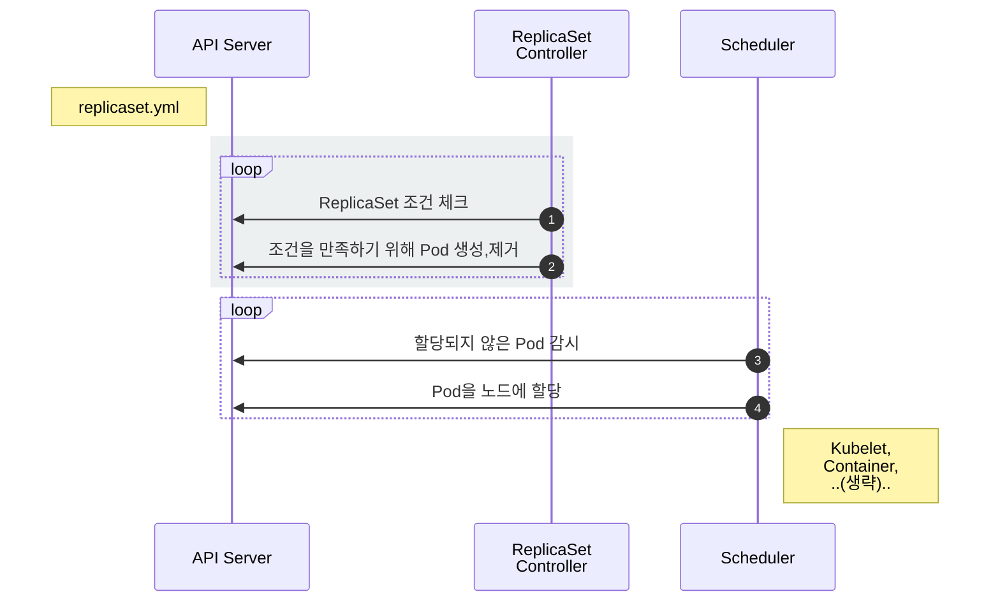

# ReplicaSet

::: tip ⚡️ 목표
ReplicaSet(복제셋)이 무엇인지 알아보고 ReplicaSet을 이용하여 Pod을 관리하는 방법을 살펴봅니다.
:::

Pod을 단독으로 만들면 Pod에 어떤 문제(서버가 죽어서 Pod이 사라졌다던가)가 생겼을 때 자동으로 복구되지 않습니다. 이러한 Pod을 정해진 수만큼 복제하고 관리하는 것이 ReplicaSet입니다.

[[toc]]

## ReplicaSet 만들기

이전에 만든 Pod을 ReplicaSet으로 만들어 봅니다.

<<< @/src/.vuepress/public/code/guide/replicaset/echo-rs.yml{2,6-20}
<code-link link="guide/replicaset/echo-rs.yml"/>

Pod보다 설정이 조금 복잡하지만, 각 항목을 이해하면 아주 어렵지 않습니다. 일단 생성하고 상세 내용을 봅시다.

```sh
# ReplicaSet 생성
kubectl apply -f echo-rs.yml

# 리소스 확인
kubectl get po,rs
```

**실행 결과**

```
NAME                READY   STATUS    RESTARTS   AGE
pod/echo-rs-tcdwj   1/1     Running   0          61s

NAME                      DESIRED   CURRENT   READY   AGE
replicaset.apps/echo-rs   1         1         1       61s
```

ReplicaSet과 Pod이 같이 생성된 것을 볼 수 있습니다.

<div style="text-align: center; width: 400px; max-width: 100%; margin: 0 auto">
  <custom-image src="/imgs/guide/replicaset/rs.png" alt="ReplicaSet" />
</div>

ReplicaSet은 `label을 체크`해서 `원하는 수`의 Pod이 없으면 `새로운 Pod`을 생성합니다. 이를 설정으로 표현하면 다음과 같습니다.

| 정의            | 설명              |
| --------------- | ----------------- |
| `spec.selector` | label 체크 조건   |
| `spec.replicas` | 원하는 Pod의 개수 |
| `spec.template` | 생성할 Pod의 명세 |

`template`을 자세히 보니 이전에 본 Pod 설정 파일과 **완전히 동일**한 것을 알 수 있습니다.

```yaml
metadata:
  labels:
    app: echo
    tier: app
spec:
  containers:
    - name: echo
      image: ghcr.io/subicura/echo:v1
```

생성된 Pod의 label을 확인해봅니다.

```sh
kubectl get pod --show-labels
```

**실행 결과**

```
NAME            READY   STATUS    RESTARTS   AGE   LABELS
echo-rs-tcdwj   1/1     Running   0          3m    app=echo,tier=app
```

설정한 대로 `app=echo,tier=app` label이 보입니다. 그럼 임의로 label을 제거하면 어떻게 될까요?

```sh
# app- 를 지정하면 app label을 제거
kubectl label pod/echo-rs-tcdwj app-

# 다시 Pod 확인
kubectl get pod --show-labels
```

**실행 결과**

```{2,3}
NAME            READY   STATUS    RESTARTS   AGE   LABELS
echo-rs-tcdwj   1/1     Running   0          3m    tier=app
echo-rs-kv4mh   1/1     Running   0          5s    app=echo,tier=app
```

기존에 생성된 Pod의 `app` label이 사라지면서 `selector`에 정의한 `app=echo,tier=app` 조건을 만족하는 Pod의 개수가 0이 되어 새로운 Pod이 만들어졌습니다.

다시 `app` label을 추가해봅니다.

```sh
# app- 를 지정하면 app label을 제거
kubectl label pod/echo-rs-tcdwj app=echo

# 다시 Pod 확인
kubectl get pod --show-labels
```

**실행 결과**

```{3}
NAME            READY   STATUS        RESTARTS   AGE     LABELS
echo-rs-h4q86   1/1     Running       0          4m      app=echo,tier=app
echo-rs-kv4mh   0/1     Terminating   0          2m19s   app=echo,tier=app
```

`replicas`에 정의한 대로 Pod의 개수를 1로 유지하기 위해 기존 Pod을 제거합니다.

ReplicaSet이 어떻게 동작하는지 살펴봅니다.

::: mermaid



:::

1. `ReplicaSet Controller`는 ReplicaSet조건을 감시하면서 현재 상태와 원하는 상태가 다른 것을 체크
2. `ReplicaSet Controller`가 원하는 상태가 되도록 `Pod`을 생성하거나 제거
3. `Scheduler`는 API서버를 감시하면서 할당되지 않은<sup>unassigned</sup> `Pod`이 있는지 체크
4. `Scheduler`는 할당되지 않은 새로운 `Pod`을 감지하고 적절한 `노드`<sup>node</sup>에 배치
5. 이후 노드는 기존대로 동작

ReplicaSet은 ReplicaSet Controller가 관리하고 Pod의 할당은 여전히 Scheduler가 관리합니다. 각자 맡은 역할을 충실히 수행하는 모습이 보기 좋습니다.

## 스케일 아웃

ReplicaSet을 이용하면 손쉽게 Pod을 여러개로 복제할 수 있습니다.

<<< @/src/.vuepress/public/code/guide/replicaset/echo-rs-scaled.yml{6}
<code-link link="guide/replicaset/echo-rs-scaled.yml"/>

이전에 작성한 것과 차이점은 `replicas: 4` 입니다. 바로 실행해봅니다.

```
kubectl apply -f echo-rs-scaled.yml

# Pod 확인
kubectl get pod,rs
```

**실행 결과**

```{3-5,8}
NAME                READY   STATUS    RESTARTS   AGE
pod/echo-rs-h4q86   1/1     Running   0          12m
pod/echo-rs-4wk6t   1/1     Running   0          2m12s
pod/echo-rs-nkgf2   1/1     Running   0          2m12s
pod/echo-rs-xpqnc   1/1     Running   0          2m12s

NAME                      DESIRED   CURRENT   READY   AGE
replicaset.apps/echo-rs   4         4         4       12m
```

기존에 생성된 Pod외에 3개가 추가되었습니다.

## 마무리

ReplicaSet은 원하는 개수의 Pod을 유지하는 역할을 담당합니다. label을 이용하여 Pod을 체크하기 때문에 label이 겹치지 않게 신경써서 정의해야 합니다.

실전에서 ReplicaSet을 단독으로 쓰는 경우는 거의 없습니다. 바로 다음에서 배울 Deployment가 ReplicaSet을 이용하고 주로 Deployment를 사용합니다.

## 참고

[ReplicaSet v1 apps](https://kubernetes.io/docs/reference/generated/kubernetes-api/v1.23/#replicaset-v1-apps)

## 문제

**문제1. 다음 조건을 만족하는 ReplicaSet을 만드세요.**

| 키                    | 값           |
| --------------------- | ------------ |
| `ReplicaSet 이름`     | nginx        |
| `ReplicaSet selector` | app: nginx   |
| `ReplicaSet 복제수`   | 3            |
| `Container 이름`      | nginx        |
| `Container 이미지`    | nginx:latest |

::: details 정답
<<< @/src/.vuepress/public/code/guide/replicaset/exam1.yml
<code-link link="guide/replicaset/exam1.yml"/>
:::
