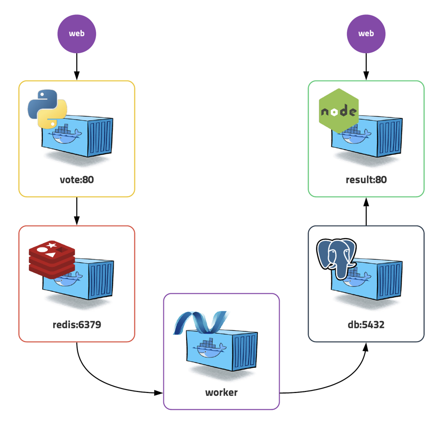

# 웹 애플리케이션 배포

::: tip ⚡️ 목표
Pod, ReplicaSet, Deployment, Service를 이용하여 기본적인 웹 애플리케이션을 배포합니다.
:::

중간 점검 시간입니다. 지금까지 배운것을 토대로 웹 애플리케이션을 배포해봅니다.

[[toc]]

## 워드프레스 배포

[준비하기](/guide/#워드프레스-배포)에서 배포했던 워드프레스를 직접 배포합니다.

**MySQL**

| 키                | 값                            |
| ----------------- | ----------------------------- |
| `컨테이너 이미지` | mysql:5.6                     |
| `포트`            | 3306                          |
| `환경변수`        | MYSQL_ROOT_PASSWORD: password |

**Wordpress**

| 키                | 값                                  |
| ----------------- | ----------------------------------- |
| `컨테이너 이미지` | wordpress:5.5.3-apache              |
| `포트`            | 80                                  |
| `환경변수`        | WORDPRESS_DB_HOST: [wordpress host] |
| `환경변수`        | WORDPRESS_DB_PASSWORD: password     |

::: details 정답
<<< @/src/.vuepress/public/code/guide/sample/wordpress.yml
<code-link link="guide/sample/wordpress.yml"/>
:::

## 투표 애플리케이션 배포

조금 더 복잡한 형태의 앱을 배포합니다.

  

**Redis**

| 키                | 값           |
| ----------------- | ------------ |
| `컨테이너 이미지` | redis:latest |
| `포트`            | 6379         |

**Postgres**

| 키                | 값                          |
| ----------------- | --------------------------- |
| `컨테이너 이미지` | postgres:9.4                |
| `포트`            | 5432                        |
| `환경변수`        | POSTGRES_USER: postgres     |
| `환경변수`        | POSTGRES_PASSWORD: postgres |

**worker**

| 키                | 값                                    |
| ----------------- | ------------------------------------- |
| `컨테이너 이미지` | ghcr.io/subicura/voting/worker:latest |
| `환경변수`        | REDIS_HOST: [redis ip]                |
| `환경변수`        | REDIS_PORT: [redis port]              |
| `환경변수`        | POSTGRES_HOST: [postgres ip]          |
| `환경변수`        | POSTGRES_PORT: [postgres port]        |

**vote**

노드 31000으로 연결

| 키                | 값                                  |
| ----------------- | ----------------------------------- |
| `컨테이너 이미지` | ghcr.io/subicura/voting/vote:latest |
| `포트`            | 80                                  |
| `환경변수`        | REDIS_HOST: [redis ip]              |
| `환경변수`        | REDIS_PORT: [redis port]            |

**result**

노드 31001으로 연결

| 키                | 값                                    |
| ----------------- | ------------------------------------- |
| `컨테이너 이미지` | ghcr.io/subicura/voting/result:latest |
| `포트`            | 80                                    |
| `환경변수`        | POSTGRES_HOST: [postgres ip]          |
| `환경변수`        | POSTGRES_PORT: [postgres port]        |

::: details 정답
<<< @/src/.vuepress/public/code/guide/sample/vote.yml
<code-link link="guide/sample/vote.yml"/>
:::
