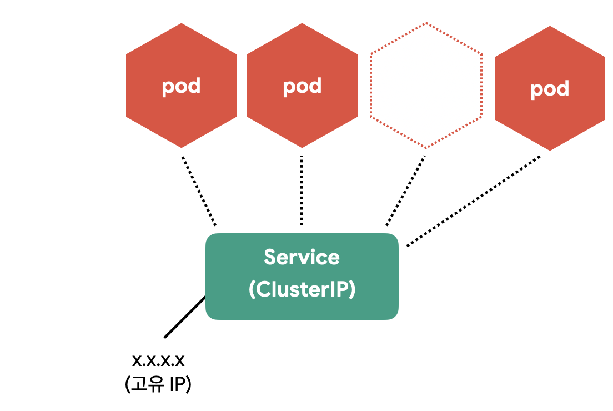
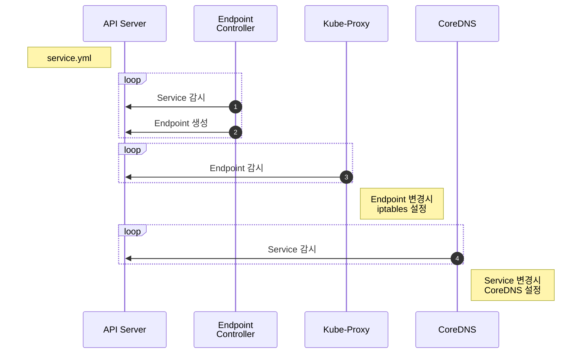
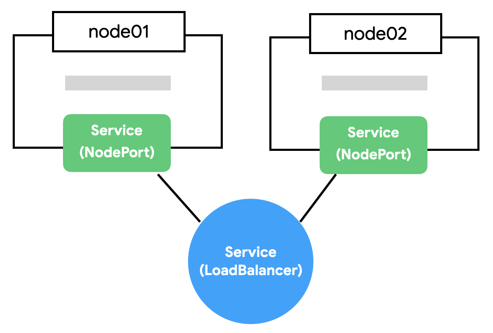

# Service

::: tip ⚡️ 목표
Service(서비스)를 이용하여 Pod을 노출하고 클러스터 외부에서 접근할 수 있는 방법을 알아봅니다.
:::

Pod은 자체 IP를 가지고 다른 Pod과 통신할 수 있지만, 쉽게 사라지고 생성되는 특징 때문에 직접 통신하는 방법은 권장하지 않습니다. 쿠버네티스는 Pod과 직접 통신하는 방법 대신, 별도의 고정된 IP를 가진 서비스를 만들고 그 서비스를 통해 Pod에 접근하는 방식을 사용합니다.

<div style="text-align: center">
  
</div>

이러한 개념은 ~~도커에 익숙할수록~~ 처음 접하면 참 어렵습니다. 개념도 생소한데 노출 범위에 따라 CluterIP, NodePort, LoadBalancer 타입으로 나누어져 더욱 헷갈립니다. 하나씩 차근차근 알아봅시다.

[[toc]]

::: warning 서비스 종류
서비스 종류 중에 `ExternalName`도 있지만 여기서는 다루지 않습니다.
:::

## Service(ClusterIP) 만들기

ClusterIP는 클러스터 내부에 새로운 IP를 할당하고 여러 개의 Pod을 바라보는 로드밸런서 기능을 제공합니다. 그리고 서비스 이름을 내부 도메인 서버에 등록하여 Pod 간에 서비스 이름으로 통신할 수 있습니다.

그럼, [다중 컨테이너](./pod.html#다중-컨테이너)를 설명할 때 만들었던, counter 앱 중에 redis를 서비스로 노출해보겠습니다.

<<< @/src/.vuepress/public/code/guide/service/counter-redis-svc.yml{23-34}
<code-link link="guide/service/counter-redis-svc.yml"/>

::: tip 구분자
하나의 YAML파일에 여러 개의 리소스를 정의할 땐 "---"를 구분자로 사용합니다.
:::

redis를 먼저 만들어 봅니다.

```sh
kubectl apply -f counter-redis-svc.yml

# Pod, ReplicaSet, Deployment, Service 상태 확인
kubectl get all
```

**실행 결과**

```{6}
NAME                         READY   STATUS    RESTARTS   AGE
pod/redis-57d787df44-mf5w5   1/1     Running   0          10s

NAME                 TYPE        CLUSTER-IP      EXTERNAL-IP   PORT(S)    AGE
service/kubernetes   ClusterIP   10.96.0.1       <none>        443/TCP    3d19h
service/redis        ClusterIP   10.103.50.102   <none>        6379/TCP   10s

NAME                    READY   UP-TO-DATE   AVAILABLE   AGE
deployment.apps/redis   1/1     1            1           10s

NAME                               DESIRED   CURRENT   READY   AGE
replicaset.apps/redis-57d787df44   1         1         1       10s
```

redis Deployment와 Service가 생성된 것을 볼 수 있습니다.

<div style="text-align: center">
  
</div>

같은 클러스터에서 생성된 Pod이라면 `redis`라는 도메인으로 redis Pod에 접근 할 수 있습니다. (`redis.default.svc.cluster.local`로도 접근가능 합니다. 서로 다른 namespace와 cluster를 구분할 수 있습니다.)

ClusterIP 서비스의 설정을 살펴봅니다.

| 정의                    | 설명                                           |
| ----------------------- | ---------------------------------------------- |
| `spec.ports.port`       | 서비스가 생성할 Port                           |
| `spec.ports.targetPort` | 서비스가 접근할 Pod의 Port (기본: port랑 동일) |
| `spec.selector`         | 서비스가 접근할 Pod의 label 조건               |

redis Service의 selector는 redis Deployment에 정의한 label을 사용했기 때문에 해당 Pod을 가리킵니다. 그리고 해당 Pod의 6379 포트로 연결하였습니다.

이제 redis에 접근할 counter 앱을 Deployment로 만듭니다.

<<< @/src/.vuepress/public/code/guide/service/counter-app.yml{20-21}
<code-link link="guide/service/counter-app.yml"/>

counter app Pod에서 redis Pod으로 접근이 되는지 테스트 해보겠습니다.

```sh
kubectl apply -f counter-app.yml

# counter app에 접근
kubectl get po
kubectl exec -it counter-<xxxxx> -- sh

# apk add curl busybox-extras # install telnet
# curl localhost:3000
# curl localhost:3000
# telnet redis 6379
  dbsize
  KEYS *
  GET count
  quit
```

Service를 통해 Pod과 성공적으로 연결되었습니다.

## Service 생성 흐름

Service는 각 Pod를 바라보는 로드밸런서 역할을 하면서 내부 도메인서버에 새로운 도메인을 생성합니다. Service가 어떻게 동작하는지 살펴봅니다.

::: mermaid



:::

1. `Endpoint Controller`는 `Service`와 `Pod`을 감시하면서 조건에 맞는 Pod의 IP를 수집
2. `Endpoint Controller`가 수집한 IP를 가지고 `Endpoint` 생성
3. `Kube-Proxy`는 `Endpoint` 변화를 감시하고 노드의 iptables을 설정
4. `CoreDNS`는 `Service`를 감시하고 서비스 이름과 IP를 `CoreDNS`에 추가

`iptables`는 커널<sup>kernel</sup> 레벨의 네트워크 도구이고 `CoreDNS`는 빠르고 편리하게 사용할 수 있는 클러스터 내부용 도메인 네임 서버 입니다. 각각의 역할은 `iptables` 설정으로 여러 IP에 트래픽을 전달하고 `CoreDNS`를 이용하여 IP 대신 도메인 이름을 사용합니다.

::: tip iptables
iptables는 규칙이 많아지면 성능이 느려지는 이슈가 있어, `ipvs`를 사용하는 옵션도 있습니다.
:::

::: tip CoreDNS
CoreDNS는 클러스터에서 호환성을 위해 `kube-dns`라는 이름으로 생성됩니다.
:::

갑자기 Endpoint가 나왔습니다. Endpoint는 서비스의 접속 정보를 가지고 있습니다. Endpoint의 상태를 확인해 보겠습니다.

```sh
kubectl get endpoints
kubectl get ep #줄여서

# redis Endpoint 확인
kubectl describe ep/redis
```

**실행 결과**

```{6}
Name:         redis
Namespace:    default
Labels:       <none>
Annotations:  endpoints.kubernetes.io/last-change-trigger-time: ...
Subsets:
  Addresses:          172.17.0.2
  NotReadyAddresses:  <none>
  Ports:
    Name     Port  Protocol
    ----     ----  --------
    <unset>  6379  TCP

Events:  <none>
```

Endpoint Addresses 정보에 Redis Pod의 IP가 보입니다. (Replicas가 여러개였다면 여러 IP가 보입니다.)

## Service(NodePort) 만들기

CluterIP는 클러스터 내부에서만 접근할 수 있습니다. 클러스터 외부(노드)에서 접근할 수 있도록 NodePort 서비스를 만들어봅니다.

<<< @/src/.vuepress/public/code/guide/service/counter-nodeport.yml{6-10}
<code-link link="guide/service/counter-nodeport.yml"/>

| 정의                  | 설명                                                     |
| --------------------- | -------------------------------------------------------- |
| `spec.ports.nodePort` | 노드에 오픈할 Port (미지정시 30000-32768 중에 자동 할당) |

counter app을 해당 노드의 31000으로 오픈합니다.

```sh
kubectl apply -f counter-nodeport.yml

# 서비스 상태 확인
kubectl get svc
```

**실행 결과**

```{2}
NAME         TYPE        CLUSTER-IP       EXTERNAL-IP   PORT(S)          AGE
counter-np   NodePort    10.101.168.165   <none>        3000:31000/TCP   13s
kubernetes   ClusterIP   10.96.0.1        <none>        443/TCP          3d19h
redis        ClusterIP   10.103.50.102    <none>        6379/TCP         30m
```

`minikube ip`로 테스트 클러스터의 노드 IP를 구하고 31000으로 접근해봅니다.

```sh
curl 192.168.64.4:31000 # 또는 브라우저에서 접근
```

<div style="text-align: center">
  
</div>

NodePort는 클러스터의 모든 노드에 포트를 오픈합니다. 지금은 테스트라서 하나의 노드밖에 없지만 여러 개의 노드가 있다면 아무 노드로 접근해도 지정한 Pod으로 쏘옥 접근할 수 있습니다.

<div style="text-align: center">
  
</div>

::: tip NodePort와 ClusterIP
NodePort는 CluterIP의 기능을 기본으로 포함합니다.
:::

## Service(LoadBalancer) 만들기

NodePort의 단점은 노드가 사라졌을 때 자동으로 다른 노드를 통해 접근이 불가능하다는 점입니다. 예를 들어, 3개의 노드가 있다면 3개 중에 아무 노드로 접근해도 NodePort로 연결할 수 있지만 어떤 노드가 살아 있는지는 알 수가 없습니다.

<div style="text-align: center">
  
</div>

자동으로 살아 있는 노드에 접근하기 위해 모든 노드를 바라보는 `Load Balancer`가 필요합니다. 브라우저는 NodePort에 직접 요청을 보내는 것이 아니라 Load Balancer에 요청하고 Load Balancer가 알아서 살아 있는 노드에 접근하면 NodePort의 단점을 없앨 수 있습니다.

Load Balancer를 생성해 봅니다.

<<< @/src/.vuepress/public/code/guide/service/counter-lb.yml{6}
<code-link link="guide/service/counter-lb.yml"/>

```sh
kubectl apply -f counter-lb.yml
```

**실행 결과**

```{2}
NAME         TYPE           CLUSTER-IP       EXTERNAL-IP   PORT(S)           AGE
counter-lb   LoadBalancer   10.109.133.129   <pending>     30000:31535/TCP   9s
counter-np   NodePort       10.101.168.165   <none>        3000:31000/TCP    34m
kubernetes   ClusterIP      10.96.0.1        <none>        443/TCP           3d20h
redis        ClusterIP      10.103.50.102    <none>        6379/TCP          65m
```

counter-lb가 생성되었지만, `EXTERNAL-IP`가 `<pending>`인 것을 확인할 수 있습니다. 사실 Load Balancer는 AWS, Google Cloud, Azure 같은 클라우드 환경이 아니면 사용이 제한적입니다. 특정 서버(노드)를 가리키는 무언가(Load Balancer)가 필요한데 이런 `무언가`가 가상머신이나 로컬 서버에는 존재하지 않습니다.

### minikube에 가상 LoadBalancer 만들기

Load Balancer를 사용할 수 없는 환경에서 가상 환경을 만들어 주는 것이 `MetalLB`라는 것입니다. minikube에서는 현재 떠 있는 노드를 Load Balancer로 설정합니다. minikube의 `addons` 명령어로 활성화합니다.

```sh
minikube addons enable metallb
```

그리고 `minikube ip`명령어로 확인한 ip를 ConfigMap으로 지정해야 합니다.

<<< @/src/.vuepress/public/code/guide/service/metallb-cm.yml{12}
<code-link link="guide/service/metallb-cm.yml"/>

```sh
kubectl apply -f metallb-cm.yml

# 다시 서비스 확인
kubectl get svc
```

**실행 결과**

```{2}
NAME         TYPE           CLUSTER-IP       EXTERNAL-IP   PORT(S)           AGE
counter-lb   LoadBalancer   10.109.133.129   192.168.64.4  30000:31535/TCP   1m
counter-np   NodePort       10.101.168.165   <none>        3000:31000/TCP    35m
kubernetes   ClusterIP      10.96.0.1        <none>        443/TCP           3d20h
redis        ClusterIP      10.103.50.102    <none>        6379/TCP          66m
```

이제 `192.168.64.4:30000`으로 접근해봅니다.

::: tip LoadBalancer와 NodePort
LoadBalancer는 NodePort의 기능을 기본으로 포함합니다.
:::

## 마무리

서비스는 로우레벨<sup>low level</sup> 수준의 네트워크를 이해하고 성능, 보안 이슈를 신경 써야 합니다. 파고들면 한없이 복잡하고 어려운 부분으로 일단 그렇구나.. 하고 넘어갑니다. 😭

실전에선 NodePort와 LoadBalancer를 제한적으로 사용합니다. 보통 웹 애플리케이션을 배포하면 80 또는 443 포트를 사용하고 하나의 포트에서 여러 개의 서비스를 도메인이나 경로에 따라 다르게 연결하기 때문입니다. 이 부분은 뒤에 Ingress에서 자세히 알아봅니다.

## 참고

[Service v1 core](https://kubernetes.io/docs/reference/generated/kubernetes-api/v1.20/#service-v1-core)
[네트워크 통신 시각화](https://matthewpalmer.net/kubernetes-app-developer/articles/kubernetes-networking-guide-beginners.html)

## 문제

**문제1. echo 서비스를 NodePort로 32000 포트로 오픈합니다.**

| 키                  | 값                       |
| ------------------- | ------------------------ |
| `Deployment 이름`   | echo                     |
| `Deployment Label`  | app: echo                |
| `Deployment 복제수` | 3                        |
| `Container 이름`    | echo                     |
| `Container 이미지`  | ghcr.io/subicura/echo:v1 |
| `NodePort 이름`     | echo                     |
| `NodePort Port`     | 3000                     |
| `NodePort NodePort` | 32000                    |

::: details 정답
<<< @/src/.vuepress/public/code/guide/service/exam1.yml
<code-link link="guide/service/exam1.yml"/>
:::
