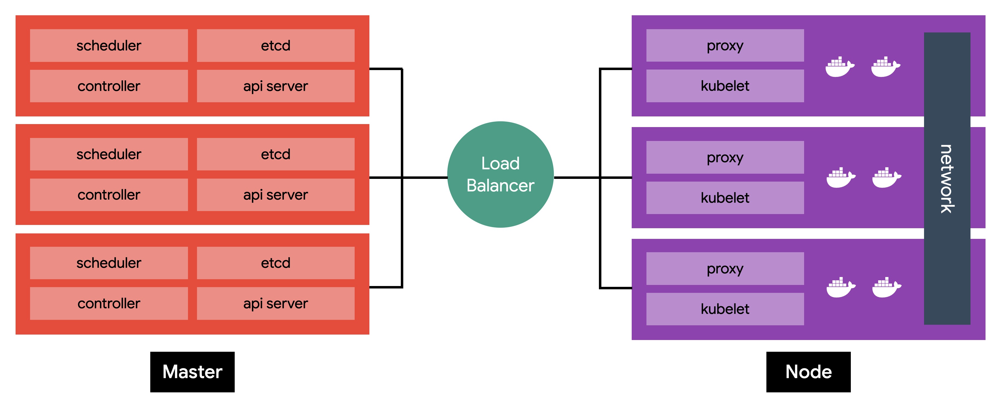
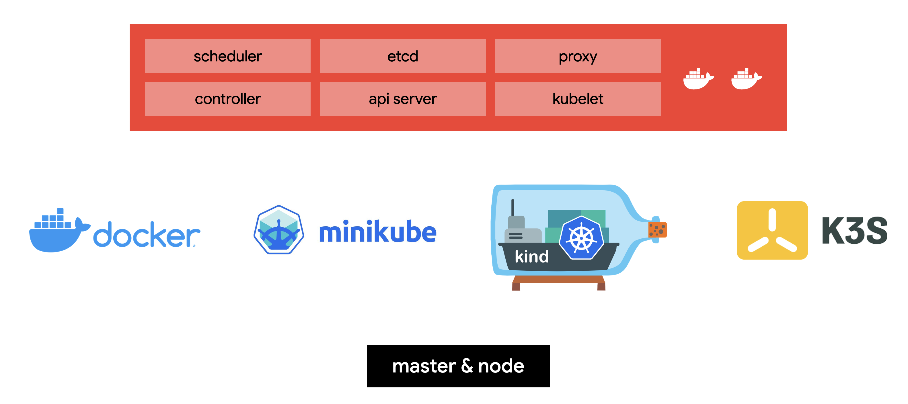
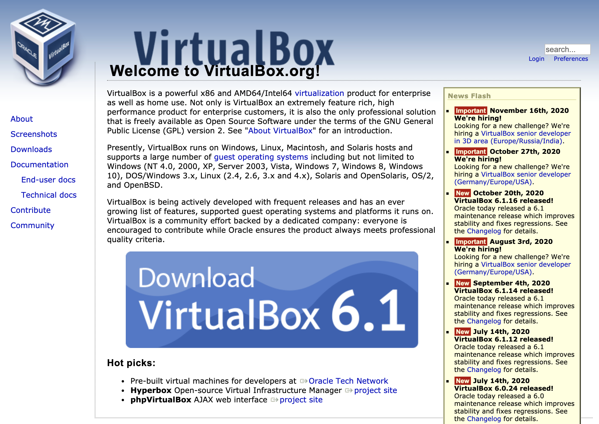
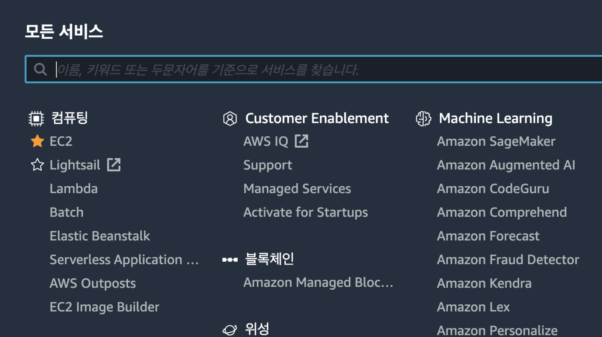
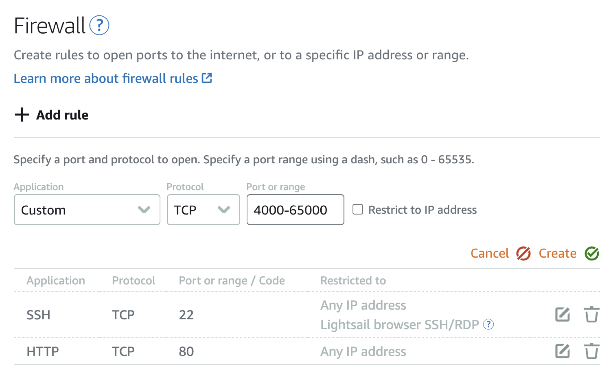
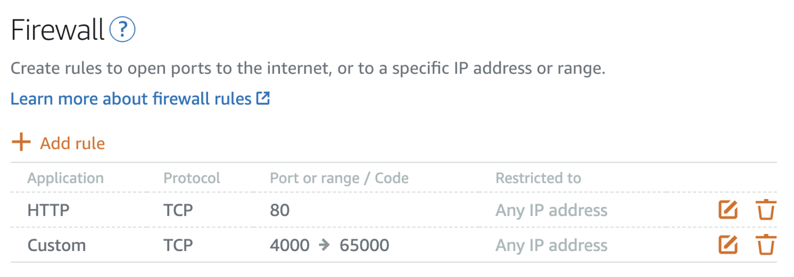
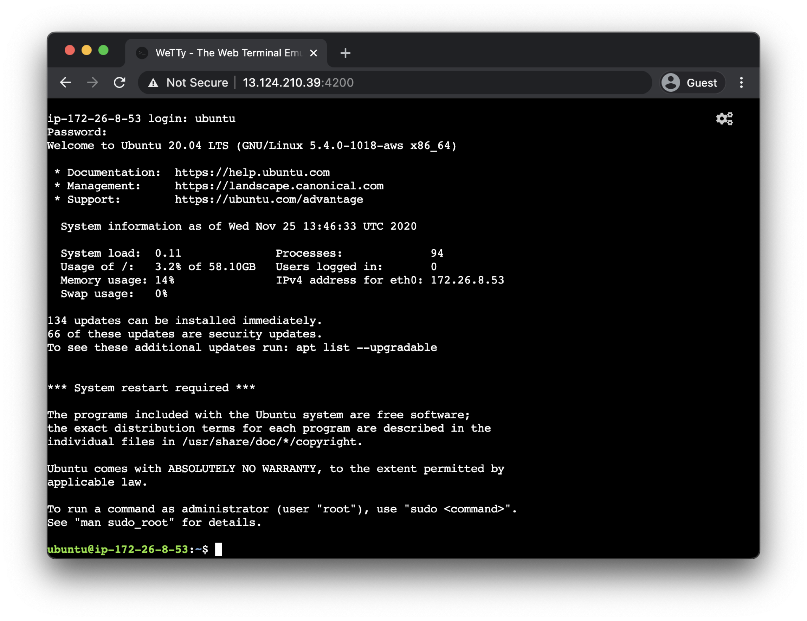

# 쿠버네티스 설치

::: tip ⚡️ 목표
쿠버네티스 실습을 위해 클러스터를 설치합니다.
:::

[[toc]]

## 개발 vs 운영

쿠버네티스를 운영환경에 설치하기 위해선 최소 3대의 마스터 서버와 컨테이너 배포를 위한 n개의 노드 서버가 필요합니다.



이러한 설치는 과정이 복잡하고 배포 환경(AWS, Google Cloud, Azure, Bare Metal, ...)에 따라 방법이 다르기 때문에 처음 공부할 때 바로 구축하기는 적합하지 않습니다.

여기선 개발 환경을 위해 마스터와 노드를 하나의 서버에 설치하여 손쉽게 관리하는 방법을 사용합니다.



대표적인 개발 환경 구축 방법으로 [minikube](./kubernetes-setup.md#minikube), [k3s](./kubernetes-setup.md#k3s), [docker for desktop](./kubernetes-setup.md#docker-for-desktop), [kind](./kubernetes-setup.md#kind)가 있습니다.

대부분의 환경에서 사용할 수 있고 간편하며, 무료인 [minikube](./kubernetes-setup.md#minikube)를 추천하지만 설치할 수 없거나 사양이 낮은 경우엔 저렴한 비용으로 테스트할 수 있는(1,000원 이하) [k3s](./kubernetes-setup.md#k3s)를 추천합니다.

::: warning 주의
개발환경과 운영환경의 가장 큰 차이점은 개발환경은 단일 노드로 여러 노드에 스케줄링하는 테스트가 어렵고 LoadBalancer와 Persistent Local Storage 또한 가상으로 만들어야 합니다.
이러한 실습을 정확하게 하려면 운영환경(멀티노드)에서 진행해야 합니다.
:::

## minikube

쿠버네티스 클러스터를 실행하려면 최소한 scheduler, controller, api-server, etcd, kubelet, kube-proxy를 설치해야 하고 필요에 따라 dns, ingress controller, storage class등을 설치해야 합니다. 쿠버네티스는 설치 또한 중요한 과정이지만 처음 공부할 땐 설치보단 실질적인 사용법을 익히는 게 중요합니다.

이러한 설치를 쉽고 빠르게 하기 위한 도구가 [minikube](https://github.com/kubernetes/minikube)입니다. minikube는 windows, macOS, linux에서 사용할 수 있고 다양한 가상 환경(Hyperkit, Hyper-V, Docker, VirtualBox등)을 지원하여 대부분의 환경에서 문제없이 동작합니다.

### windows

**설치**

[minikube-installer.exe](https://github.com/kubernetes/minikube/releases/latest/download/minikube-installer.exe)파일을 다운로드합니다.

**Hyper-V 활성화**

관리자 권한으로 `CMD(명령프롬프트)` 실행후 다음 명령어를 입력합니다.

::: warning 지원확인
Windows 10 Enterprise, Pro, or Education에서 Hyper-V를 지원합니다. 그 외에는 virtual box를 이용해주세요.
:::

```sh
DISM /Online /Enable-Feature /All /FeatureName:Microsoft-Hyper-V
```

**기본 명령어**

```sh
# 버전확인
minikube version

# 가상머신 시작 (반드시 관리자권한으로 실행)
minikube start --driver=hyperv
# driver 에러가 발생한다면 virtual box를 사용
minikube start --driver=virtualbox
# 특정 k8s 버전 실행
minikube start --kubernetes-version=v1.20.0

# 상태확인
minikube status

# 정지
minikube stop

# 삭제
minikube delete

# ssh 접속
minikube ssh

# ip 확인
minikube ip
```

**Docker Desktop**

::: warning 설치버전
Docker Desktop 3.0.0 + WSL2 환경에서 테스트하였습니다.
:::

Docker Dekstop이 설치되어 있으면 minikube가 기본으로 `docker` driver를 사용합니다. docker 드라이브러를 사용할 경우 서비스 노출 방법입니다.

샘플로 테스트한 wordpress의 쿠버네티스의 노출 포트는 31428이지만 접근하기 위해서는 `minikube service`명령어를 입력하고 프록시를 통해 접속해야 합니다.

```sh
# 쿠버네티스 서비스 이름이 wordpress라면..
minikube service wordpress
```

**실행 결과**

```
|-----------|-----------|-------------|---------------------------|
| NAMESPACE |   NAME    | TARGET PORT |            URL            |
|-----------|-----------|-------------|---------------------------|
| default   | wordpress |          80 | http://192.168.49.2:31428 |
|-----------|-----------|-------------|---------------------------|
   Starting tunnel for service wordpress.
|-----------|-----------|-------------|------------------------|
| NAMESPACE |   NAME    | TARGET PORT |          URL           |
|-----------|-----------|-------------|------------------------|
| default   | wordpress |             | http://127.0.0.1:58969 |
|-----------|-----------|-------------|------------------------|
   Opening service default/wordpress in default browser...
❗  Because you are using a Docker driver on windows, the terminal needs to be open to run it.
```

`minikube service`를 실행한 상태에서 ~~127.0.0.1:31428~~이 아닌 127.0.0.1:58969로 접속합니다.

### macOS

**설치**

```sh
# homebrew를 사용하고 있다면..
brew install minikube

# homebrew를 사용하지 않는다면, 직접 binary 다운로드
curl -Lo minikube https://storage.googleapis.com/minikube/releases/latest/minikube-darwin-amd64 \
  && chmod +x minikube
```

**기본 명령어**

```sh
# 버전확인
minikube version

# 가상머신 시작
minikube start --driver=hyperkit
# driver 에러가 발생한다면 virtual box를 사용
minikube start --driver=virtualbox
# 특정 k8s 버전 실행
minikube start --kubernetes-version=v1.20.0

# 상태확인
minikube status

# 정지
minikube stop

# 삭제
minikube delete

# ssh 접속
minikube ssh

# ip 확인
minikube ip
```

### linux

**설치**

```sh
# docker 사용시 설치 필요, docker를 사용하지 않는 경우 virtual box 설치
curl -fsSL https://get.docker.com/ | sudo sh
sudo usermod -aG docker $USER

# docker 대신 virtual box 설치
sudo apt-get install virtualbox

# install minikube
curl -Lo minikube https://storage.googleapis.com/minikube/releases/latest/minikube-linux-amd64 \
  && chmod +x minikube
sudo mkdir -p /usr/local/bin/
sudo install minikube /usr/local/bin/
```

**기본 명령어**

```sh
# 버전확인
minikube version

# 가상머신 시작
minikube start --driver=docker
# driver 에러가 발생한다면 virtual box를 사용
minikube start --driver=virtualbox
# 특정 k8s 버전 실행
minikube start --kubernetes-version=v1.20.0

# 상태확인
minikube status

# 정지
minikube stop

# 삭제
minikube delete

# ssh 접속
minikube ssh

# ip 확인
minikube ip
```

### VirtualBox 설치

OS에서 지원하는 가상화 기능을 사용할 수 없는 경우 `VirtualBox`를 설치합니다.



`Download`버튼을 눌러서 설치합니다.

## k3s

minikube를 사용할 수 없거나 네트워크등 여러가지 이슈로 실습이 어려운 경우, 별도 클라우드 서버에 k3s를 설치하여 원격으로 실습할 수 있습니다.

여기선 [AWS Lightsail](https://aws.amazon.com/ko/free/compute/lightsail)에 설치하는 법을 소개하며 한 달 동안 가상머신을 사용했을 때 \$20, 하루 동안 실습할 경우 1,000원 이하의 비용이 발생합니다.

::: tip
설치스크립트에 브라우저 기반 터미널 프로그램인 [wetty](https://github.com/butlerx/wetty)를 포함하여 별도의 프로그램 없이 브라우저로 실습 할 수 있습니다.
`vi`, `nano`와 같은 리눅스용 에디터에 익숙하지 않다면 웹 기반 [Visual Studio를 설치](https://github.com/subicura/workshop-init/blob/master/99_code_server.md)해 주세요.
:::

1. AWS 로그인 후, Lightsail 메뉴를 선택



2. 새로운 인스턴스 생성 - Create instance 선택


3. Linux / Ubuntu 20.04 선택


4. Add launch script를 선택 후 다음 명령어 입력

```sh
sed -i 's/PasswordAuthentication no/PasswordAuthentication yes/' /etc/ssh/sshd_config
echo "ubuntu:1q2w3e4r!!" | chpasswd
service sshd reload
curl -sL https://deb.nodesource.com/setup_14.x | bash -
apt-get -y update
DEBIAN_FRONTEND=noninteractive apt-get -y install nodejs build-essential
npm install -g wetty --unsafe
ln -s /usr/bin/wetty /usr/local/bin/wetty
curl https://gist.githubusercontent.com/subicura/9058671c16e2abd36533fea2798886b0/raw/e5d249612711b14c9c8f44798dea1368395e86a9/wetty.service -o /lib/systemd/system/wetty.service
systemctl start wetty
systemctl enable wetty
```

5. 2 vCPUs / 4 GB 또는 더 나은 사양 선택


6. 가상 서버 생성이 완료되면 이름 선택


7. Networking 탭 선택후 방화벽 허용 (4000-65000) **SSH(22)는 반드시 제거**



8. 방화벽 설정 결과



9. Public IP 주소와 4200 port로 접속 (아이디/패스워드 - ubuntu/1q2w3e4r!!)



10. k3s 설치

```sh
curl -sfL https://get.k3s.io | sh -
sudo chown ubuntu:ubuntu /etc/rancher/k3s/k3s.yaml

# 확인
kubectl get nodes

# 설정 복사
cp /etc/rancher/k3s/k3s.yaml ~/.kube/config
```

## 그외

### docker for desktop

docker for desktop에서 쿠버네티스 클러스터를 활성화할 수 있습니다.


docker for desktop은 리소스(CPU, 메모리)를 많이 차지하기 때문에 가급적 실습할 때 껐다 켜기 쉬운 minikube를 추천합니다.

### kind

도커 컨테이너 기반 다중 노드 테스트

- [kind](https://kind.sigs.k8s.io/)

## 운영환경

- [kubeadm](https://kubernetes.io/docs/setup/production-environment/tools/kubeadm/install-kubeadm/)
- [kubespray](https://github.com/kubernetes-sigs/kubespray)
- [Amazon EKS](https://aws.amazon.com/ko/eks)
- [Google Kubernetes Engine](https://cloud.google.com/kubernetes-engine)
- [Azure Kubernetes Service](https://docs.microsoft.com/ko-kr/azure/aks/)
